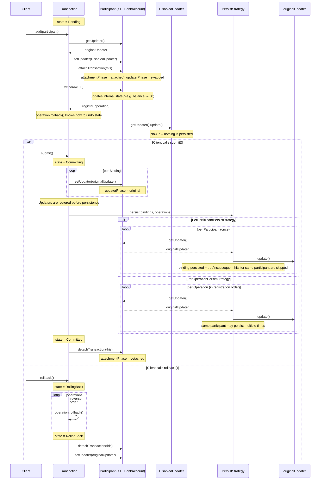

# @frxnklyn/transaction-manager

Ein generischer Transaction Manager für beliebige Domain-Objekte. Änderungen erfolgen sofort am Objekt im Arbeitsspeicher. Die externe Persistierung wird bis zu `submit()` aufgeschoben; ein Rollback führt ausschließlich die registrierten Gegenoperationen in umgekehrter Reihenfolge aus.

Das Paket kennt keine Json-, Datei-, Ticket- oder Datenbanklogik.

## Struktur

```text
src/
├── interfaces/
│   ├── TransactionContextInterface.ts
│   ├── TransactionOperationInterface.ts
│   └── TransactionParticipantInterface.ts
├── transaction/
│   ├── Transaction.ts
│   ├── TransactionOperation.ts
│   ├── TransactionParticipantBinding.ts
│   ├── TransactionState.ts
│   └── TransactionStateMachine.ts
├── updater/
│   ├── Updater.ts
│   ├── UpdaterInterface.ts
│   └── DisabledUpdater.ts
└── TransactionManager.ts
```

`Updater`, `UpdaterInterface` und `TrackedFile` behalten ihren bestehenden Autoupdate-/Tracked-File-Vertrag. Das Interface wird nicht um eine Persistenzmethode erweitert.

## Verwendung mit `run()`

```ts
import { TransactionManager } from "@frxnklyn/transaction-manager";

const manager = new TransactionManager();

await manager.run([jsonEditor, ticketEditor], async () => {
  await jsonEditor.addKey("user.name", "Brooklyn");
  await ticketEditor.changeStatus("done");
});
```

`run()` hängt die Participants an, führt den Callback aus und ruft anschließend `submit()` auf. Bei einem Callback- oder Submit-Fehler wird rollback ausgeführt, sofern die Transaction noch nicht erfolgreich committed ist.

## Explizite Transaction

```ts
const transaction = transactionManager.createTransaction();

try {
  transaction.add(jsonEditor);

  await jsonEditor.addKey("user.name", "Brooklyn");
  await jsonEditor.removeKey("user.temporary");

  await transaction.submit();
} catch (error) {
  if (transaction.getState() === TransactionState.Pending
    || transaction.getState() === TransactionState.Failed) {
    await transaction.rollback();
  }

  throw error;
}
```

`commit()` bleibt als Kompatibilitätsalias für `submit()` verfügbar.

## Participant-Integration

Eine `TransactionOperation` enthält keine Execute-Funktion. Die öffentliche Participant-Methode führt die Änderung direkt aus und registriert anschließend nur noch die Gegenoperation.

```ts
import {
  TransactionOperation,
  Updater,
  type TransactionContextInterface,
  type TransactionParticipantInterface,
  type UpdaterInterface,
} from "@frxnklyn/transaction-manager";

interface PersistingUpdater extends UpdaterInterface {
  update(): void | Promise<void>;
}

class JsonUpdater extends Updater implements PersistingUpdater {
  constructor(
    private readonly persist: () => void | Promise<void>,
  ) {
    super();
  }

  update(): void | Promise<void> {
    return this.persist();
  }
}

class JsonEditor implements TransactionParticipantInterface {
  private transactionContext: TransactionContextInterface | undefined;

  constructor(private updater: UpdaterInterface) {}

  getUpdater(): UpdaterInterface {
    return this.updater;
  }

  setUpdater(updater: UpdaterInterface): void {
    this.updater = updater;
  }

  attachTransaction(context: TransactionContextInterface): void {
    if (this.transactionContext !== undefined) {
      throw new Error("JsonEditor is already attached to a transaction.");
    }

    this.transactionContext = context;
  }

  detachTransaction(context: TransactionContextInterface): void {
    if (this.transactionContext !== context) {
      throw new Error("Unexpected transaction context.");
    }

    this.transactionContext = undefined;
  }

  async addKey(path: string, value: unknown): Promise<void> {
    this.addKeyDirectly(path, value);

    const operation = new TransactionOperation(
      `json.addKey:${path}`,
      this,
      () => this.removeKeyDirectly(path),
    );

    if (this.transactionContext !== undefined) {
      this.transactionContext.register(operation);
      return;
    }

    await this.persist();
  }

  private async persist(): Promise<void> {
    const updater = this.updater as UpdaterInterface & {
      update?: () => void | Promise<void>;
    };

    if (typeof updater.update !== "function") {
      throw new Error("The configured updater cannot persist changes.");
    }

    await updater.update();
  }

  private addKeyDirectly(path: string, value: unknown): void {
    // Nur In-Memory-Zustand ändern.
  }

  private removeKeyDirectly(path: string): void {
    // Nur In-Memory-Zustand ändern.
  }
}
```

Die Änderung muss vor `register(operation)` erfolgreich abgeschlossen sein. Schlägt die direkte Änderung fehl, wird keine Operation registriert. Bei komplexen Änderungen muss die Rollback-Funktion den zuvor gespeicherten Zustand verwenden.

## Submit-Ablauf

1. `add(participant)` speichert exakt dessen bisherigen Updater, setzt `DisabledUpdater` und übergibt den Transaction-Kontext.
2. Participant-Methoden ändern ihren Zustand direkt und registrieren nur die zugehörige Rollback-Operation.
3. `submit()` stellt für alle Teilnehmer zuerst die Original-Updater wieder her.
4. Dann persistiert es nach der konfigurierten Strategy:
   - `PerParticipantPersistStrategy` schreibt jeden Teilnehmer einmal.
   - `PerOperationPersistStrategy` schreibt pro registrierter Operation in Reihenfolge.
5. Schließlich werden die Participants detached und exakt ihre vorherigen Updater-Instanzen wieder eingesetzt.

Ein konkreter Original-Updater muss für Submit zusätzlich eine Laufzeitmethode `update(): void | Promise<void>` besitzen. Das bestehende `UpdaterInterface` bleibt dabei unverändert. Fehlt diese Methode, schlägt Submit mit `CommitError` fehl.

## Merkmale der neuen Commit-Sequenz



## Rollback

`rollback()` ruft alle registrierten Rollback-Funktionen in strikter LIFO-Reihenfolge auf. Der Original-Updater wird dabei nie persistiert. Danach werden Context und Original-Updater wiederhergestellt. Mehrere Rollback-Fehler werden in `RollbackError.errors` gesammelt.

`retryCleanup()` ist nur nach einem bereits erfolgreichen Submit erlaubt und versucht ausschließlich ein fehlgeschlagenes Detach oder die Updater-Wiederherstellung erneut. Es führt weder Persistierung noch Rollback erneut aus.

## Öffentliche API

- `TransactionManager`, `Transaction`, `TransactionState`, `TransactionStateMachine`
- `TransactionContextInterface`, `TransactionParticipantInterface`
- `TransactionOperation`, `TransactionOperationInterface`, `TransactionRollbackFunction`
- `Updater`, `UpdaterInterface`, `TrackedFile`, `DisabledUpdater`
- `CommitError` / `TransactionCommitError`, `RollbackError` / `TransactionRollbackError`

## Grenzen

- Keine atomare Distributed Transaction und kein Two-Phase Commit. Ein früher Updater kann extern bereits erfolgreich gespeichert haben, wenn ein späterer fehlschlägt.
- Keine verschachtelten Transactions, keine Prozess-Recovery und keine globale Registrierung.
- Kein Rollback nach erfolgreichem Submit.
- Die Bibliothek bietet keine Isolation oder Sperren zwischen unabhängigen Aufrufern.
