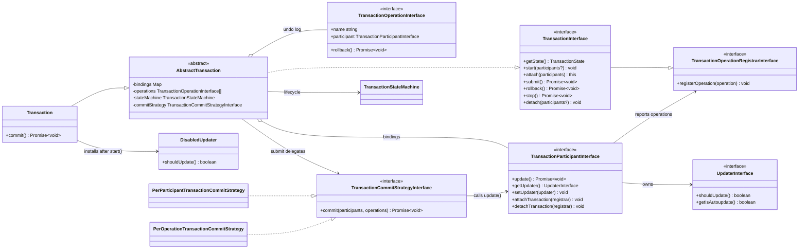

# @frxnklyn/transaction-manager

Ein generischer Transaction Manager für Domain-Objekte. Änderungen werden
sofort im Speicher ausgeführt. Eine Transaction erfasst ausschließlich die
bereits ausgeführten Änderungen für einen möglichen Rollback und schiebt die
Persistierung bis zu `submit()` auf.

## Kernverträge

- `TransactionParticipantInterface` besitzt `update()`, verwaltet seinen
  `UpdaterInterface` und kann einen `TransactionOperationRegistrarInterface`
  attachen beziehungsweise detachen.
- `UpdaterInterface` enthält nur den bestehenden Autoupdate- und
  Tracked-File-Vertrag. Es besitzt bewusst keine `update()`-Methode.
- `TransactionOperationRegistrarInterface` stellt ausschließlich
  `registerOperation()` bereit.
- `TransactionOperationInterface` beschreibt eine bereits ausgeführte Änderung
  mit Participant, Diagnose-Name und Rollback-Funktion.
- `TransactionCommitStrategyInterface` entscheidet, wie oft und in welcher
  Reihenfolge `participant.update()` während `submit()` aufgerufen wird.

## Architektur



Der Participant führt Änderungen sofort aus und registriert anschließend nur
die Gegenoperation. Nach `start()` verhindert der `DisabledUpdater` während
`Initialized` die automatische Persistierung. Bei `submit()` installiert
`AbstractTransaction` zuerst den festen `EnabledUpdater` und übergibt danach an
die gewählte Commit-Strategie.

## Verwendung

```ts
import {
  Transaction,
  TransactionOperation,
  type TransactionOperationRegistrarInterface,
  type TransactionParticipantInterface,
  type UpdaterInterface,
} from "@frxnklyn/transaction-manager";

class Participant implements TransactionParticipantInterface {
  private transaction: TransactionOperationRegistrarInterface | undefined;

  constructor(
    private updater: UpdaterInterface,
    private value = "",
  ) {}

  update(): void | Promise<void> {
    // Persistiert den aktuellen Participant-Zustand, sofern der installierte
    // Updater dies zulässt.
  }

  getUpdater(): UpdaterInterface {
    return this.updater;
  }

  setUpdater(updater: UpdaterInterface): void {
    this.updater = updater;
  }

  attachTransaction(
    transaction: TransactionOperationRegistrarInterface,
  ): void {
    this.transaction = transaction;
  }

  detachTransaction(
    transaction: TransactionOperationRegistrarInterface,
  ): void {
    if (this.transaction !== transaction) {
      throw new Error("Unexpected transaction registrar.");
    }

    this.transaction = undefined;
  }

  async setValue(nextValue: string): Promise<void> {
    const previousValue = this.value;
    this.value = nextValue;

    if (this.transaction !== undefined) {
      this.transaction.registerOperation(
        new TransactionOperation("setValue", this, () => {
          this.value = previousValue;
        }),
      );
    }

    await this.update();
  }
}

const transaction = new Transaction();
transaction.attach(participantA).attach(participantB);
transaction.start();

await participantA.setValue("next");
await transaction.submit();
```

`start()` akzeptiert einen einzelnen Participant oder ein readonly Array. Die
Transaction befindet sich ab ihrer Erzeugung im Wartezustand `Pending`.
`attach()` merkt Participants nur vor. `start()` wechselt nach `Initialized`, hängt die
vorgemerkten Participants an und installiert die temporären Updater.

## Temporärer Updater

`Transaction` installiert beim Start einen festen `DisabledUpdater`. Er meldet
über den vorhandenen Updater-Vertrag, dass kein automatisches Update stattfinden
soll. Persistenzlogik bleibt im Participant. Vor dem Commit wird ein fester
`EnabledUpdater` installiert, weil die Transaction nicht wissen muss, welches
Verhalten der ursprüngliche Updater intern hat. `stop()` und `rollback()` stellen
den ursprünglichen Updater wieder her.

## Commit-Strategien

- `PerParticipantTransactionCommitStrategy` ruft `update()` einmal pro
  angehängtem Participant in Attachment-Reihenfolge auf. Dies ist der Standard.
- `PerOperationTransactionCommitStrategy` ruft `update()` einmal pro
  registrierter Operation in Registrierungsreihenfolge auf.

Die Operationen werden beim Commit nie erneut ausgeführt. Beide Strategien
erhalten eingefrorene Snapshots der Participant- und Operation-Arrays, nachdem
alle Participants den festen `EnabledUpdater` erhalten haben.

## Lifecycle

- `submit()`: festen `EnabledUpdater` installieren, Commit-Strategie ausführen,
  Participants attached lassen, kurz zu `Committed` wechseln und nach `Pending`
  zurückkehren.
- `rollback()`: Operationen in umgekehrter Reihenfolge zurückrollen,
  Original-Updater wiederherstellen, Participants attached lassen, kurz zu `RolledBack` wechseln
  und nach `Pending` zurückkehren.
- `stop()`: weder persistieren noch zurückrollen, sondern nur Original-Updater
  wiederherstellen, Participants attached lassen, kurz zu `Stopped` wechseln und nach `Pending`
  zurückkehren. Der Speicherzustand bleibt erhalten.
- `detach()`: einen, mehrere oder alle Participants explizit von der Transaction
  lösen. Dabei läuft derselbe Cleanup-Pfad wie bei Setup-Fehlern: Original-Updater
  restaurieren, Registrar detachen, keine erneute Persistierung.

Verwendete States:

```text
Pending -> Initialized
Initialized -> Running | Committing | RollingBack | Stopping | Failed
Running -> Running | Initialized | Committing | RollingBack | Stopping | Failed
Committing -> Committed | Failed
Committed -> Pending
RollingBack -> RolledBack | Failed
RolledBack -> Pending
Stopping -> Stopped | Failed
Stopped -> Pending
Failed -> Pending | RollingBack
```

`Failed` kann für manuelle Fehlerbehandlung zurück nach `Pending` geführt werden
oder einen erneuten Rollback-Versuch starten.

## Entwicklung

```sh
npm run build
npm test
```
